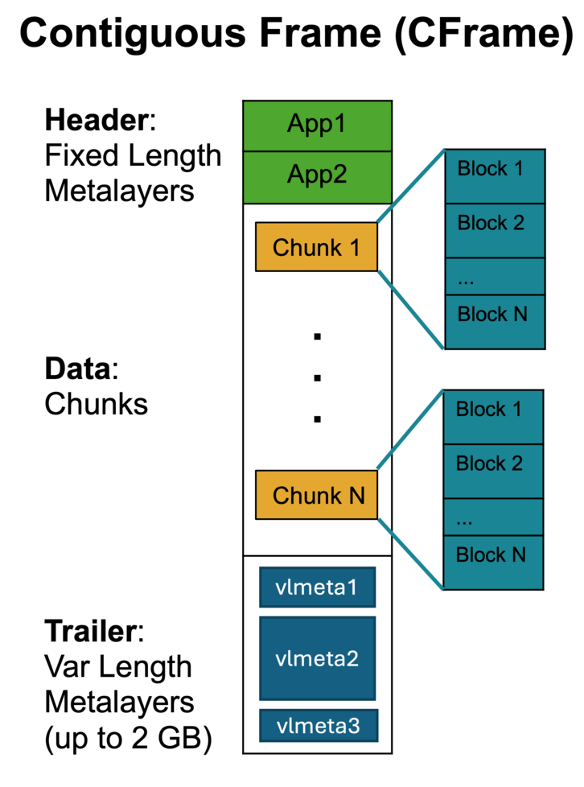

Blosc2 Format
=============

The Blosc2 format is a specification for storing compressed data in a way that is simple to read and parse,
and that allows for fast random access to the compressed data. The format is designed to be used with
the Blosc2 library, but it is not tied to it, and can be used independently.  Emphasis has been put on
simplicity and robustness, so that the format can be used in a wide range of applications.

See a diagram of a Contiguous Frame (aka CFrame), the most important part of the Blosc2 format below:

And here, the list of the different parts of the format, from the highest level to the lowest:

- `B2ND format <https://github.com/Blosc/c-blosc2/blob/main/README_B2ND_FORMAT.rst>`_
- `B2ND metalayer <https://github.com/Blosc/c-blosc2/blob/main/README_B2ND_METALAYER.rst>`_
- `SFrame format <https://github.com/Blosc/c-blosc2/blob/main/README_SFRAME_FORMAT.rst>`_
- `CFrame format <https://github.com/Blosc/c-blosc2/blob/main/README_CFRAME_FORMAT.rst>`_
- `Chunk format <https://github.com/Blosc/c-blosc2/blob/main/README_CHUNK_FORMAT.rst>`_

Finally, the recommended extension file names for the different parts of the format:

- `Blosc2 extension file names <https://github.com/Blosc/c-blosc2/blob/main/README_EXTENSION_FILENAMES.rst>`_
