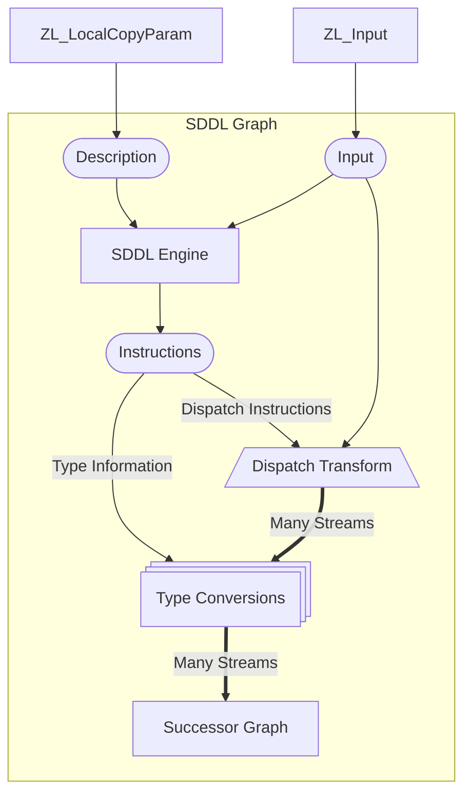

## Introduction

> [!WARNING] This document describes the syntax for the first version of the
> SDDL language. This differs from the version currently in development.

OpenZL's backend compression graphs are most effective on streams of
self-similar, typed data.

The Simple Data Description Language (SDDL) module provides a lightweight tool
to decompose simple structured data formats into their components, so that they
can be effectively compressed by OpenZL's backends.

The SDDL functionality is comprised of a few pieces:

- The SDDL graph, which takes a compiled description and uses it to parse and
  decompose the input into a number of output streams.

- The SDDL compiler, which takes a description written in the SDDL language and
  translates it into the binary format that the SDDL engine accepts.

- The SDDL profile, a pre-built compressor available in the CLI which runs SDDL
  on the input and passes all of its outputs to the generic clustering graph.

These components and how to use them are described below.

## Writing an SDDL Description

The Simple Data Description Language is a Domain-Specific Language that makes it
easy to describe to OpenZL the components that make up simple data formats.

The fundamental task of an SDDL Description is to associate each byte of the
input stream with a corresponding **Field**, whose purpose is to give OpenZL a
hint for how to group and handle that part of the input. SDDL has a number of
built-in fields, like `UInt32LE` or `Byte`. Descriptions can also construct
compound fields (analogous to C structs and arrays) out of other fields.

The operative part of an SDDL Description, the part that actually constructs
that association between a part of the input stream and a **Field**, is an
operation called **consumption**. Consumption is represented by the `:` operator
and looks like `: Byte`, for example.

!!! example "Introductory Example"

    Imagine you are trying to compress a stream of readings from an accelerometer. Suppose the format you receive is an array of samples, each of which looks like this in C:

    ```
    struct AccelerometerSample {
        uint64_t timestamp;
        float x_accel;
        float y_accel;
        float z_accel;
    };
    ```

    A possible SDDL description of this format would be:

    ```
    # Declare a new compound field "AccelerometerSample" which describes the
    # structure of an individual sample using a Record, SDDL's aggregate type.
    AccelerometerSample = {
        timestamp : UInt64LE;
        x_accel : Float32LE;
        y_accel : Float32LE;
        z_accel : Float32LE;
    }

    # Consume the whole input as an array of AccelerometerSample records.
    : AccelerometerSample[]
    ```

When executing an SDDL Description, the SDDL engine starts at the beginning of
the input. As the execution proceeds, and the description is applied to the
input, each consumption operation associates the next byte(s), starting at the
current position, with the consumed field and then advances past the consumed
content.

The task of the description is complete when all of the input has been consumed.
(If the description ends and the whole input hasn't been consumed, or if the
description tries to consume bytes past the end of the input, the execution
fails.)

### Examples

While there's an in-depth language/syntax reference available below, the best
way to gain familiarity with SDDL is probably to look at some examples. So here
are a couple:

#### SAO

??? example "SAO File Description"

    ```
    # Send all header fields to the same output
    HeaderInt = UInt32LE

    Header = {
      STAR0: HeaderInt
      STAR1: HeaderInt  # First star number in file
      STARN: HeaderInt  # Number of stars in file
      STNUM: HeaderInt  # star i.d. number presence
      MPROP: HeaderInt  # True if proper motion is included
      NMAG : HeaderInt  # Number of magnitudes present
      NBENT: HeaderInt  # Number of bytes per star entry
    }

    Row = {
      SRA0 : Float64LE  # Right ascension in degrees
      SDEC0: Float64LE  # Declination in degrees
      IS   : Byte[2]    # Instrument status flags
      MAG  : UInt16LE   # Magnitude * 100
      XRPM : Float32LE  # X-axis rate per minute
      XDPM : Float32LE  # X-axis drift per minute
    }

    # Read the header
    header: Header

    # Validate format expectations
    expect header.STNUM == 0
    expect header.MPROP == 1
    expect header.NMAG  == 1
    expect header.NBENT == sizeof Row

    # The header is followed by STARN records
    data: Row[header.STARN]
    ```

#### Bitmap Images

??? example "BMP v3 Format Description"

    ```
    # Supports uncompressed BMP Version 3 formatted files, described here:
    # https://gibberlings3.github.io/iesdp/file_formats/ie_formats/bmp.htm
    # Convert images to this with:
    # ```
    # magick $SOURCE -compress none BMP3:$DEST
    # ```

    GenericU8 = UInt8
    GenericU16 = UInt16LE
    GenericU32 = UInt32LE

    FileHeader = {
      signature   : GenericU16
      file_size   : GenericU32
      reserved    : GenericU32
      data_offset : GenericU32
    }

    file_header : FileHeader

    expect file_header.signature == 0x4d42  # "BM"
    expect file_header.reserved == 0

    InfoHeader = {
      header_size      : GenericU32
      width            : GenericU32
      height           : GenericU32
      planes           : GenericU16
      bits_per_pixel   : GenericU16
      compression      : GenericU32
      image_size       : GenericU32
      x_pixels_per_m   : GenericU32
      y_pixels_per_m   : GenericU32
      colors_used      : GenericU32
      important_colors : GenericU32
    }

    info_header : InfoHeader

    expect info_header.compression == 0

    width = info_header.width
    height = info_header.height
    bits_per_pixel = info_header.bits_per_pixel

    num_colors = (
      (bits_per_pixel == 1) * 2 +
      (bits_per_pixel == 4) * 16 +
      (bits_per_pixel == 8) * 256
    )

    ColorTableEntry = {
      red      : GenericU8;
      green    : GenericU8;
      blue     : GenericU8;
      reserved : GenericU8;
    }

    color_table_entries : ColorTableEntry[num_colors];

    row1_bytes  = 4 * ((width + 31) / 32)
    row4_bytes  = 4 * ((width +  7) /  8)
    row8_bytes  = 4 * ((width +  3) /  4)
    row16_bytes = 4 * ((width +  1) /  2)
    row24_bytes = 4 * ((width +  1) * 3 / 4)

    Image = {
      : GenericU8[row1_bytes][height][bits_per_pixel == 1]
      : GenericU8[row4_bytes][height][bits_per_pixel == 4]
      : GenericU8[row8_bytes][height][bits_per_pixel == 8]
      : GenericU16[row16_bytes / 2][height][bits_per_pixel == 16]
      : GenericU8[row24_bytes][height][bits_per_pixel == 24]
    }

    image : Image
    ```

#### Binary STL Files

??? example "STLB Format Description"

    ```
    # Binary STL Files begin with an 80-byte header.
    header : Byte[80]

    # Followed by the number of triangles they store.
    triangle_count : UInt32LE

    Triangle = {
        normal_vec : Float32LE[3]
        vertices   : Float32LE[3][3]
        attributes : Byte[2]
    }

    # The rest of the file is triangles
    : Triangle[triangle_count]
    ```

## Running SDDL

### The SDDL Profile

The easiest way to run SDDL over an input is via the SDDL profile built into the
CLI.

!!! example Start by writing an SDDL Description for your data. Here's a trivial
one that splits the input into alternating integer streams:

    ```sh
    cat <<EOF >desc.sddl
    Row = {
      UInt32LE
      UInt32LE
    }
    num_rows = _rem / sizeof Row
    : Row[num_rows]

    # Consume any remaining input.
    : Byte[_rem]
    EOF
    ```

    Then compress an input using that description:

    ```sh
    ./zli compress --profile sddl --profile-arg desc.sddl --train-inline my_input_file -o my_input_file.zl
    ```

    Since the SDDL profile passes the results of the parse produced by the SDDL graph to the generic clustering graph, which needs to be trained, the `--train-inline` flag is important to get good performance.

    If you are compressing many inputs with the same profile, it's much faster to do the training once and use the resulting trained profile for each input rather than training on each and every input separately:

    ```sh
    ./zli train --profile sddl --profile-arg desc.sddl input_dir/ -o trained_sddl.zlc

    for f in $(ls input_dir/); do
      ./zli compress --compressor trained_sddl.zlc input_dir/$f -o output_dir/$f.zl
    done
    ```

### The SDDL Graph

The SDDL Graph allows you to integrate SDDL into compressors other than the
prebuilt SDDL profile. You can create an SDDL graph with
`ZL_Compressor_buildSDDLGraph`:

::: ZL_Compressor_buildSDDLGraph

The SDDL Graph has the following structure:



This graph takes a single serial input and applies the given description to it,
using that description to decompose the input into fields which are mapped to
one or more output streams. These streams, as well as two control streams are
all sent to a single invocation of the successor graph. The successor must
therefore be a multi-input graph able to accept any number of numeric and serial
streams (at least).

(The control streams are: a numeric stream containing the stream indices into
which each field has been placed and a numeric stream containing the size of
each field. See also the documentation for `dispatchN_byTag` and particularly,
`ZL_Edge_runDispatchNode()`, which is the underlying component that this graph
uses to actually decompose the input, for more information about the dispatch
operation. These streams respectively are the first and second stream passed
into the successor graph, and the streams into which the input has been
dispatched follow, in order.)

The streams on which the successor graph is invoked are also tagged with int
metadata, with key 0 set to their index. (For the moment. Future work may allow
for more robust/stable tagging.) This makes this graph compatible with the
generic clustering graph (see `ZL_Clustering_registerGraph()`), and the `sddl`
profile in the demo CLI, for example, is set up that way, with the SDDL graph
succeeded by the generic clusterer.

The description given to the graph must be pre-compiled. Use the SDDL Compiler
to translate your description to the compiled representation that the graph
accepts:

### The SDDL Compiler

The SDDL compiler can be invoked in a few different ways:

#### The SDDL Profile

The `sddl` profile in the CLI internally invokes the compiler as part of setting
up the compressor.

#### Standalone Binary

A simple, standalone compiler binary is also available.

!!! example "CMake Build Instructions"

    ```
    mkdir tmp
    cd tmp
    cmake .. -DOPENZL_BUILD_TOOLS=ON
    make sddl_compiler
    ```

!!! example "Make Build Instructions"

    ```
    make sddl_compiler
    ```

The SDDL compiler binary takes in a program from `stdin` and writes the compiled
code to `stdout`. It takes any number of `-v` flags as arguments, which increase
the verbosity of the compiler. This can be a useful aid when your program isn't
compiling correctly.

#### C++ API

A C++ API is offered in `tools/sddl/compiler/Compiler.h`:

::: openzl::sddl::Compiler::compile

#### Compiled Representation

The SDDL engine accepts, and the SDDL compiler produces, a translated / compiled
representation of the description, which is a CBOR-serialized expression tree.

!!! danger The compiled format is unstable and subject to change!

    You should not expect SDDL descriptions compiled with one version of OpenZL to work with SDDL graphs from other versions of OpenZL. Nor should you currently build codegen that targets this unstable format.

--8<-- "src/tools/sddl/compiler/Syntax.md"
